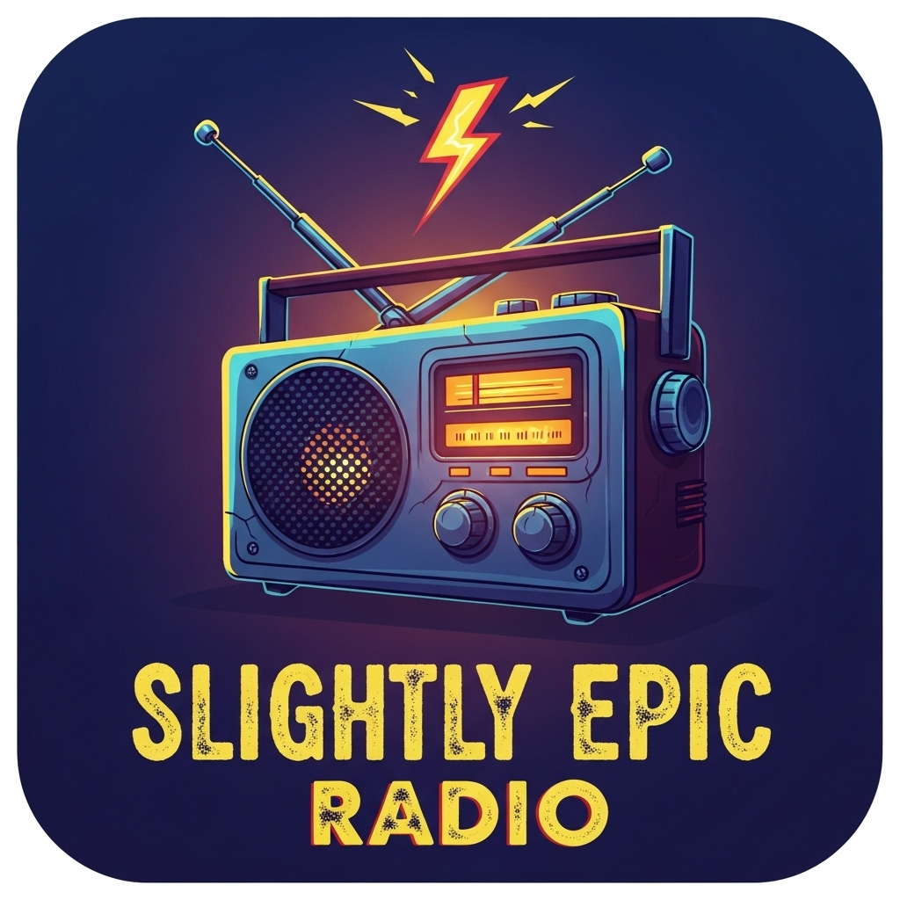

# Slightly Epic Radio



An internet radio streaming app for Roku. Browse and listen to a curated selection of streaming radio stations directly on your Roku device.

## Features

- Stream internet radio stations in MP3 format
- Browse stations using a scrollable row list overlay
- Full-screen playback with station artwork
- Simple remote-friendly navigation (UP to browse, DOWN to dismiss)

## Current Stations

- **Slightly Epic Mashups** — mashup music stream

## Getting Started

1. Enable [Developer Mode](https://developer.roku.com/docs/developer-program/getting-started/developer-setup.md) on your Roku device
2. Package or side-load the app to your Roku
3. The default station begins playing automatically — press UP to browse other stations

## Project Structure

```
source/
  main.brs              - App entry point
components/
  HomeScene.xml          - Main scene layout (video player, row list, animations)
  HomeScene.brs          - Scene logic and key handling
  Config.brs             - Station feed configuration
  RowListItems.xml       - Row list item template
  tasks/
    RowListContentTask.brs - Async content loader
    RowListContentTask.xml
images/                  - Station logos, splash screen, and icons
manifest                 - Roku channel metadata
```

## License

[Roku Developer Tools License Agreement](https://docs.roku.com/doc/developersdk/en-us)
